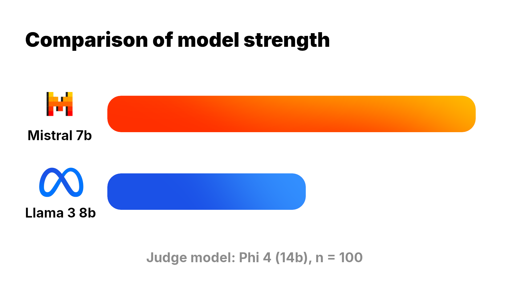

<p align="center">
    
</p>

# hle-eval-ollama

<p align="center">
    
</p>

This repo aims to **allow anyone to get up and running with [Humanity's Last Exam](https://lastexam.ai/) and Ollama locally**.

The official repo with evaluation scripts by HLE is notoriously hard to use, only lightly documented and merely made to work with the OpenAI API. Re-writing it to work with more AI inference providers and APIs would only add more complexity, which is **why I chose to create this repository**.

## How to use it

It's luckily simple! First of all, make sure to have a [Hugging Face](https://huggingface.co/) account. The HLE dataset is **gated**, which means that you will need to authenticate in order to use it. You may want to visit the [HLE page](https://huggingface.co/datasets/cais/hle) on Hugging Face and agree to your information being submitted.

```bash
python3 -m venv .venv
. ./.venv/bin/activate
pip install -r ./requirements.txt
```

Generate a Hugging Face access token [here](https://huggingface.co/settings/tokens) and copy it to your clipboard.
Then, run

```
huggingface-cli login
```

Now you're all set! For example, run

```bash
python3 ./src/eval.py --model=gemma3 --judge=llama3:8b --num-questions=150
```

to begin the exam for the model! Results will also be written to an output file in the project root directory, ending in `.results.json`.

**Tip**: You can specify several models separated by commas in order to make them compete against each other. You can - and must - only specify one judge model (the model that will rate the answers), and it's highly recommended to choose a model that isn't part of the models taking the exam.

**Important**: Do not just perform separate runs with `--num-questions` specified, as this will pick different, random questions from the dataset for each run individually. If you want to compare models with a limited number of questions, use the tip described above.

**For text-only models** specify `--only-text` to only use the text subset of the HLE dataset.

## Example results

Below is a comparison of two commonly used models; they've been asked 100 questions from the text-only subset and the answers were judged by Phi-4 (14b) by Microsoft.

**These are by no means professionally taken, high-quality results and thus not representative.**

```
$ python3 ./src/eval.py --model=llama3:8b,mistral:7b --judge=phi4:latest --num-questions=100 --only-text
[...]
hle-eval-ollama: INFO - llama3:8b: 7 correct, 89 wrong (7.29 percent)
hle-eval-ollama: INFO - mistral:7b: 13 correct, 83 wrong (13.54 percent)
```

<p align="center">
    
</p>

## Environment variables

- `HLE_OLLAMA_HOST`: specifies the Ollama host to connect to.
- `HLE_OLLAMA_TOKEN`: specifies the Bearer token to use for Ollama authentication.

## Thanks

Huge thanks to the [creators](https://github.com/centerforaisafety/hle/blob/main/citation.txt) of Humanity's last exam for the extraordinarily hard questions!

Also, huge thanks to the Ollama contributors and creators of all the [packages](./requirements.txt) used for this project!
